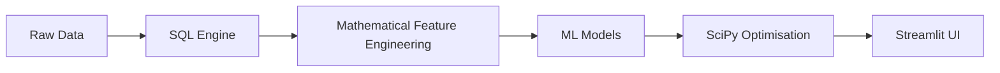

# OptiChurn-Health: End-to-End Predictive Analytics and Resource Optimisation

An enterprise-grade data science application that pairs advanced mathematical modeling with machine learning to predict patient/customer attrition and mathematically optimise corporate retention budgets.

## 📌 Project Overview
This project simulates a private healthcare sector challenge: identifying high-risk subscribers and allocating a limited retention budget to maximise business revenue. 

Unlike standard machine learning projects that rely solely on black-box algorithms, this framework integrates **classical applied mathematics** (stochastic processes, differential equations, optimization) directly into the data engineering and machine learning pipelines.

---

## 🛠️ Tech Stack & Architecture
*   **Database & Querying:** PostgreSQL / SQLite (Complex Window Functions, CTEs)
*   **Data Pipelines & Feature Engineering:** Python (`pandas`, `numpy`)
*   **Mathematical Modelling:** `scipy` (Interpolation, ODE Integration, Linear Programming)
*   **Machine Learning:** `scikit-learn` (Logistic Regression), `xgboost` (Gradient Boosted Trees)
*   **Production Deployment:** `streamlit` (Interactive Business Dashboard)

---



---

## 📐 Mathematical Framework

### 1. Data Imputation via Piecewise Polynomial Interpolation
Real-world subscription timelines often contain missing data gaps regarding user digital engagement. Rather than employing naive mean-imputation, missing continuous engagement history is reconstructed using **Cubic Spline 1D Interpolation** via `scipy.interpolate.CubicSpline`:
$$S_i(x) = a_i + b_i(x - x_i) + c_i(x - x_i)^2 + d_i(x - x_i)^3$$
This ensures the first and second derivatives remain continuous, preserving the natural velocity of user engagement trends.

### 2. Stochastic Modeling via Markov Chains
Churn is modeled fundamentally as a random process. We establish a state space $S = \{\text{Active}, \text{At Risk}, \text{Churned}\}$ and calculate an empirical transition probability matrix $P$:
```math
$$P = \begin{pmatrix} p_{11} & p_{12} & p_{13} \\ p_{21} & p_{22} & p_{23} \\ 0 & 0 & 1 \end{pmatrix}$$
```
This stochastic model acts as a rigorous mathematical baseline to evaluate our machine learning classifiers against.

### 3. Engagement Decay via Ordinary Differential Equations (ODEs)
User disengagement is modeled as a time-dependent decay function. The rate of engagement loss is governed by the first-order differential equation:
```math
$$\dfrac{dE}{dt} = -k \cdot E(t)$$
```
Integrating this analytically via `scipy.integrate.odeint` allows us to extract the decay constant ($k$) for each user, providing a high-utility predictive feature for the ML pipeline.

### 4. Non-Linear Optimization (XGBoost Objective)
The predictive engine utilizes **XGBoost**, which optimizes a regularized objective function at step $t$ using a second-order Taylor expansion:
```math
$$\displaystyle \mathcal{L}^{(t)} \approx \sum_{i=1}^{n} \left[ l(y_i, \hat{y}^{(t-1)}) + g_i f_t(x_i) + \frac{1}{2} h_i f_t^2(x_i) \right] + \Omega(f_t)$$
```
Where $g_i$ and $h_i$ are the first (gradient) and second-order (Hessian) partial derivatives of the loss function, leveraging multivariate calculus.

### 5. Prescriptive Analytics via Linear Programming
Once churn probabilities ($P_i$) are output by the ML model, the business must allocate a fixed retention budget ($B$) across $N$ users. Let $c_i$ be the cost of targeting user $i$, and $LTV_i$ be their Lifetime Value. We maximize the expected retained value using the **Simplex / Interior-Point method** via `scipy.optimize.linprog`:
```math
$$\displaystyle \text{Maximize } \sum_{i=1}^{N} P_i \cdot LTV_i \cdot x_i$$
$$\displaystyle \text{Subject to } \sum_{i=1}^{N} c_i \cdot x_i \le B$$
```
Where $x_i \in [0, 1]$ represents the continuous targeting decision variable.

---

## 📁 Repository Structure
*   `data/` - Holds raw and processed dataset variants (git-ignored).
*   `sql/` - Standalone SQL queries for feature creation and aggregation.
*   `src/` - Production-ready Python modules for math, ML pipelines, and optimization logic.
*   `app/` - Streamlit code deploying the end-to-end architecture to business stakeholders.
*   `notebooks/` - Initial exploratory data analysis (EDA).

---

## 🚀 Getting Started

1. Clone the repository and navigate to the directory:
   ```bash
   git clone https://github.com
   cd optichurn-health
   ```
2. Install the necessary dependencies:
   ```bash
   pip install -r requirements.txt
   ```
3. Run the Streamlit production application:
   ```bash
   streamlit run app/app.py
   ```
